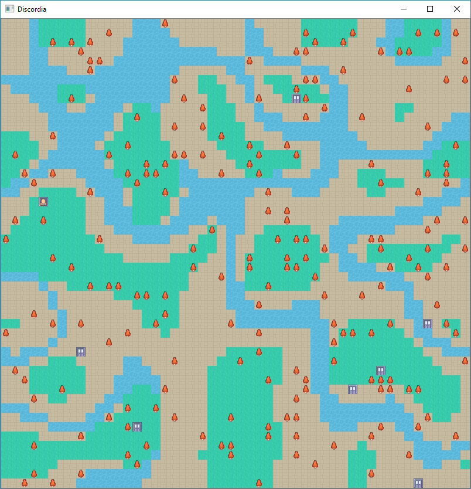

# Discordia
## The highly-anticipated* re-release of DiscordMUD

Requires Python 3.7+

# Starting 

To install:

`pip install -r requirements.txt`

`python main.py`

When prompted, enter your bot's Discord Token.

# Player Controls

* `register`
    * Create a new player character and spawn into the game world.
* `look`
    * Get your grid location, and a picture of your surroundings, as far as your `FOV` can see.
* `equipment`
    * Prints your "character sheet" in chat. Contains player name and equipment.
* [`north`, `east`, `south`, `west`] / [`up`, `right`, `down`, `left`]
    * Move your player character in the direction specified. 
* `inventory`
    * Displays a list of the items in the players inventory
    * `equip` [`index`]
        * Have your PC equip the item from your inventory with the specified index. 
    * `unequip` [`index`]
        * Remove the item from your equipment and put it back into your inventory.
* `attack` <`n`, `e`, `s`, `w`, `ne`, `se`, `sw`, `nw`>
    * Attack another player with your currently equipped weapon. If no `direction` is specified, the user will attack
    in the current position only. Otherwise, ranged weapons go in a single direction like a "beam", until they either a)
    hit another player and apply damage, or b) Miss, as the damage falloff, as each tile the projectile traverses 
    removes % damage until it goes to 0. 
* `town`
    * Calling `town` with no parameters is a debug command to check if you're inside a town or not.
    * `inn`
        * Run the events of the town's inn. Usually restores health/resources. 
    * `store`
        * Lists all the items (Name, Price, Quantity) in the Town's store. 
        * `buy` [`index`] (Placeholder)
            * Purchase the item at the given index, adding it to your inventory.
        * `sell` [`index`] (Placeholder)
            * Sell an item from your inventory, removing it and giving you some money. 
            
# Attributions

Sprites - [Kenney RPG Urban Pack](https://kenney.nl/assets/rpg-urban-pack)
