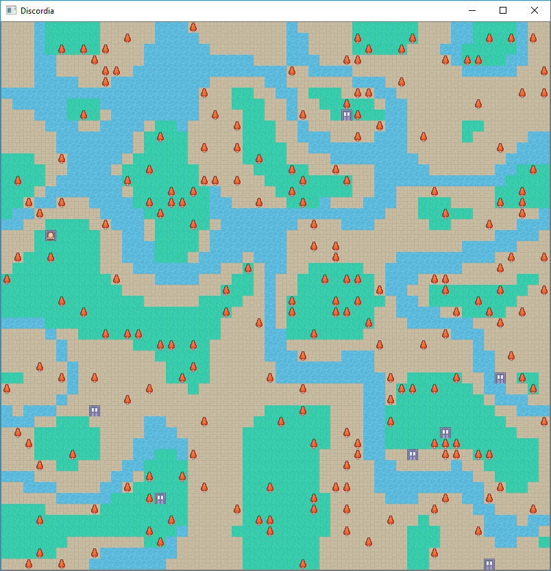

# Discordia
## The highly-anticipated* re-release of DiscordMUD

Requires Python 3.7+

# Starting 

To install:

`pip install -r requirements.txt`

`python main.py`

Set the `DISCORD_TOKEN` environment variable, or fill in `Token` under `[Discord]` in `config.ini`.

# Player Controls

All player controls are Discord slash commands. Global commands can take up to an hour to appear the first time
the bot syncs them.

* `/register` [`name`]
    * Create a new player character and spawn into the game world.
* `/look`
    * Get your grid location, and a picture of your surroundings, as far as your `FOV` can see.
* `/equipment`
    * Prints your "character sheet" in chat. Contains player name and equipment.
* `/move` [`direction`]
    * Move your player character one space in the direction picked from the dropdown.
* `/inventory list`
    * Displays a list of the items in the players inventory
    * `/inventory equip` [`index`]
        * Have your PC equip the item from your inventory with the specified index. 
    * `/inventory unequip` [`index`]
        * Remove the item from your equipment and put it back into your inventory.
* `/attack` <`direction`>
    * Attack another player with your currently equipped weapon. If no `direction` is specified, the user will attack
    in the current position only. Otherwise, ranged weapons go in a single direction like a "beam", until they either a)
    hit another player and apply damage, or b) Miss, as the damage falloff, as each tile the projectile traverses 
    removes % damage until it goes to 0. 
* `/town status`
    * Debug command to check if you're inside a town or not.
    * `/town inn`
        * Run the events of the town's inn. Usually restores health/resources. 
    * `/town recruit`
        * Change your player class to the one offered by the town.
    * `/town store list`
        * Lists all the items (Name, Price, Quantity) in the Town's store. 
        * `/town store buy` [`index`] (Placeholder)
            * Purchase the item at the given index, adding it to your inventory.
        * `/town store sell` [`index`] (Placeholder)
            * Sell an item from your inventory, removing it and giving you some money. 
            
# Attributions

Sprites - [Kenney RPG Urban Pack](https://kenney.nl/assets/rpg-urban-pack)
