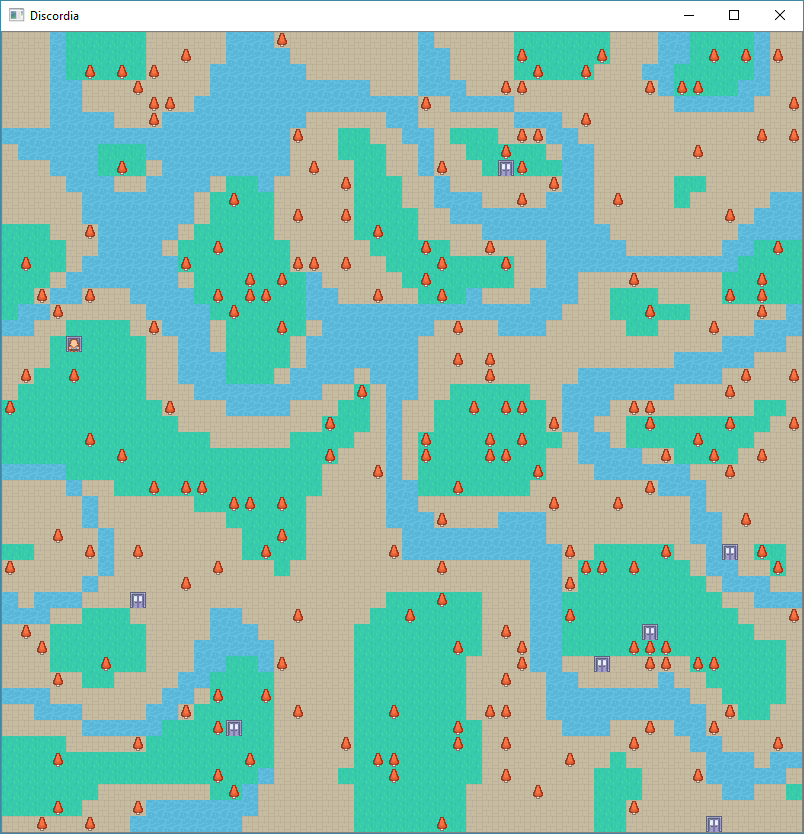

# Discordia
## The highly-anticipated* re-release of DiscordMUD

[](https://travis-ci.com/samclane/Discordia)
[](https://codecov.io/gh/samclane/Discordia)



Requires Python 3.7+

# Starting 

To install:

`pip install -r requirements.txt`

`python main.py`

Set the `DISCORD_TOKEN` environment variable, or fill in `Token` under `[Discord]` in `config.ini`.

# Deploying (Linode / any Ubuntu 24.04 box)

A Nanode (1 GB) is plenty. As root:

```
apt update && apt install -y git python3-venv python3-dev build-essential
useradd --system --home /opt/discordia discordia
git clone https://github.com/samclane/Discordia.git /opt/discordia
python3 -m venv /opt/discordia/venv
/opt/discordia/venv/bin/pip install -r /opt/discordia/requirements.txt
chown -R discordia: /opt/discordia
echo "DISCORD_TOKEN=your-token" > /etc/discordia.env && chmod 600 /etc/discordia.env
cp /opt/discordia/deploy/discordia.service /etc/systemd/system/
systemctl enable --now discordia
journalctl -u discordia -f
```

The save is `/opt/discordia/discordia.db`; copy it over first to keep an existing world. The live map binds to
localhost only, so view it through a tunnel: `ssh -L 8080:localhost:8080 root@<linode-ip>`, then open
http://localhost:8080. To update: `sudo -u discordia git -C /opt/discordia pull && systemctl restart discordia`.

# Player Controls

All player controls are Discord slash commands. Global commands can take up to an hour to appear the first time
the bot syncs them.

* `/register` [`name`]
    * Create a new player character and spawn into the game world.
* `/look`
    * Get your grid location, and a picture of your surroundings, as far as your `FOV` can see.
* `/equipment`
    * Prints your "character sheet" in chat: name, level and experience to the next one, money, health, and equipment.
* `/move` [`direction`]
    * Directions are (`north`, `east`, `south`, `west`) or (`up`, `down`, `left`, `right`)
    * Move your player character one space in the direction picked from the dropdown.
* `/inventory list`
    * Displays a list of the items in the players inventory
    * `/inventory equip` [`index`]
        * Have your PC equip the item from your inventory with the specified index. 
    * `/inventory unequip` [`index`]
        * Remove the item from your equipment and put it back into your inventory.
* `/attack` <`direction`>
    * Directions are (`north`, `east`, `south`, `west`) or (`up`, `down`, `left`, `right`), or valid in-betweens (e.x. `ne` for northeast, etc.)
    * Attack another player or an NPC with your currently equipped weapon. If no `direction` is specified, the user
    will attack in the current position only. Otherwise, ranged weapons go in a single direction like a "beam", until
    they either a) hit someone and apply damage, or b) Miss, as the damage falloff, as each tile the projectile
    traverses removes % damage until it goes to 0.
    * Killing an NPC hands you its money and whatever it was carrying.
* `/choose` [`talk`|`rob`|`ignore`]
    * Wandering the wilds can turn up a stranger on the road, who waits for you to decide what to do.
    * `talk` gets you directions to the nearest town, `rob` is a contest of your level against theirs
    (win and you take their money, lose and they hurt you), `ignore` walks on. Moving anywhere also
    counts as walking on.
* `/trade list`
    * The wilds can also turn up a trader with a few things laid out on a blanket. Lists what they have
    and what they want for it, at a markup over town prices.
    * `/trade buy` [`index`]
        * Buy the trader's item at that index. They are gone as soon as you move on.
* `/town status`
    * Calling `town` with no parameters is a debug command to check if you're inside a town or not.
    * `/town inn`
        * Run the events of the town's inn. Usually restores health/resources. 
    * `/town recruit`
        * Change your player class to the one offered by the town.
    * `/town store list`
        * Lists all the items (Name, Price, Quantity) in the Town's store. 
        * `/town store buy` [`index`] (Placeholder)
            * Purchase the item at the given index, adding it to your inventory.
        * `/town store sell` [`index`] (Placeholder)
            * Sell an item from your inventory, removing it and giving you some money. 
            
# Attributions

Sprites - [Kenney RPG Urban Pack](https://kenney.nl/assets/rpg-urban-pack)
